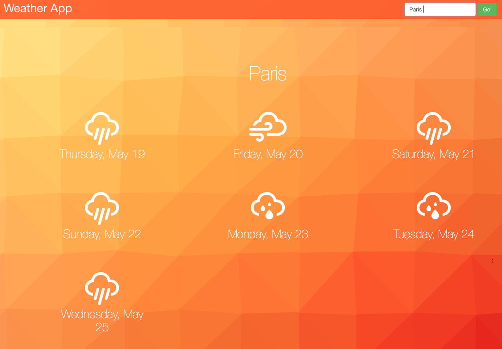

My Weather App
========
This is my first ever React app. It's the follow-up project to the [ReactJSProgram](http://www.reactjsprogram.com) Fundamentals course.

It's pretty simple (but was quite an undertaking with just that one short React course under my belt). Basically, pulls weather from the OpenWeatherMap API for any city the user requests and displays simplified forecasts. I'm showing 7 days instead of the 5 the project description called for, just for fun.

You can check it out on my site(may
A screenshot:

